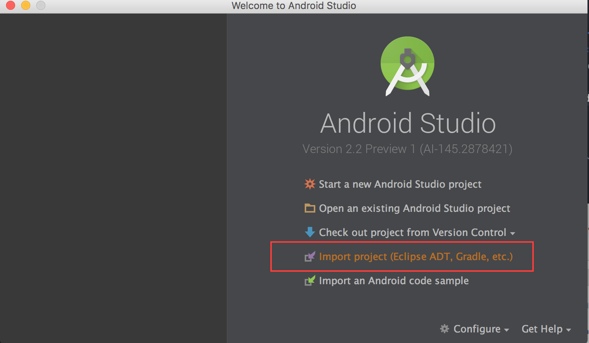

# GDG Intents "Contacts Manager" Codelab

*Updated May 2016*

This codelab is an introduction to **Android Intents**, an Android framework feature that enables applications to communicate with other [App Components](http://developer.android.com/guide/components/fundamentals.html#Components). We will start from an **existing mobile Android application** and add functionality that allows it to work with Google Maps, and a Phone and Email app. All development is done
with the [Android Studio IDE](https://developer.android.com/sdk/installing/studio.html).

The original github repository for this codelab is here:
[https://github.com/jerrellmardis/gdg-codelab-intents/](https://github.com/jerrellmardis/gdg-codelab-intents)

##Table of Contents

- [Android Intents "Contacts Manager" CodeLab](#gdg-intents-contacts-manager-codelab)
    - [Codelab Requirements](#codelab-requirements)
    - [Introduction](#introduction)
        - [The Contacts Manager application](#the-contacts-manager-application)
    - [Step 0 - Get the Android application source code](#step-0---get-the-android-application-source-code)
    - [Step 1 - Implement launching an Email application](#step-1---implement-launching-an-email-application)
    - [Step 2 - Implement launching a Phone application](#step-2---implement-launching-a-phone-application)
    - [Step 3 - Implement launching Google Maps](#step-3---implement-launching-google-maps)
    - [Step 4 - Extra Credit: Try saving the contact to your contacts app](#step-4---extra-credit:-try-saving-the-contact-to-your-contacts-app)
    - [Appendix - More on Intents and Intent Filters](#appendix---more-on-intents-and-intent-filters)

## Codelab Requirements

* A reasonably-powered laptop
* A Java Development Kit (**JDK, not JRE**), version 7 (Java 7)
* Latest **[Android Studio](http://developer.android.com/sdk/installing/studio.html#download)** (tested with [2.1](http://tools.android.com/download/studio))
    * **The Android Emulator**
        * The AVD should be created with:
            * Android 4.1 API Level 16+
            * Hardware Keyboard Present
            * SD Card present, 200MiB
    * **Android SDK Manager** (accessible from Tools > Android) configured with:
        * Android SDK Tools (tested with version 23.4.0)
        * Android SDK Platform-tools (tested with version 24)
        * Android SDK Build-tools 23.0.2
        * Android Support Repository (tested with version 31)
        * Android 4.1 (API 16+) or above
* A reasonably **good Internet connection** as the tools will download artifacts
on first builds.

## Introduction

### The Contacts Manager application

Contacts Manager is an Android application that allows you to create, call, navigate to your newly created contact and store your contact's information in your device's Contacts application.

## Step 0 - Get the Android application source code

The Android application source code is available in
[this GitHub repository](https://github.com/jerrellmardis/gdg-codelab-intents)
as a Gradle project You can get the source code on your machine by running the
following command:

```git clone https://github.com/jerrellmardis/gdg-codelab-intents```

Alternatively, you can download this [.zip archive]
(https://github.com/jerrellmardis/gdg-codelab-intents/archive/master.zip).

Open Android Studio and ``Import project (Eclipse ADT, Gradle, etc.)`` (as
shown in the screenshot below) the code as a new project.



> * If the build fails, make sure you have the **Support Repository** installed
(see last paragraph of [http://developer.android.com/sdk/installing/studio.html](http://developer.android.com/sdk/installing/studio.html)
for details).
> * If you are asked to setup an Android SDK ("Project SDK is not defined"),
simply click on the "Setup SDK" link and select the SDK without configuring it.
This codelab has been tested with API level 16.


## Step 1 - Implement launching an Email application

Let's start with adding a click listener for the Email image:

1. Add a `setupEmailListeners()` method to handle launching the Email application.
2. Call the `setupEmailListeners()` method in `onCreate(Bundle)` after setting the content view.

Paste this code into the `setupEmailListeners()` method:

```java
final EditText email = (EditText) findViewById(R.id.email_edit_text);
final View emailButton = findViewById(R.id.email_button);

if (emailButton != null && email != null) {
    // set up a click listener to open an email app when a valid email address is provided
    emailButton.setOnClickListener(new View.OnClickListener() {
        @Override
        public void onClick(View v) {
            // verify that the email address entered is valid
            if (TextUtils.isEmpty(email.getText()) || !Patterns.EMAIL_ADDRESS.matcher(email.getText()).matches()) {
                email.setError(getString(R.string.email_error_text));
            } else {
                email.setError(null);
                Intent intent = new Intent(Intent.ACTION_SENDTO);
                intent.setType("text/plain");
                intent.setData(Uri.parse("mailto:" + email.getText()));
                startActivity(intent);
            }
        }
    });
}
```

Let's breakdown the code inside the `onClick(View)` method.

```
Intent intent = new Intent(Intent.ACTION_SENDTO);
```

Intents are used as the packaging mechanism when communicating with **App Components** in the system. Above, we are constructing an **Intent** and telling the system that we intend to send a message to someone.

```
intent.setType("text/plain");
intent.setData(Uri.parse("mailto:" + email.getText()));
```

We are specifying the type of data and the data we are sending. In this case, we are sending a message of type `text/plain` with the contact's email address as an encoded `Uri` object.

```
startActivity(intent);
```

Finally, we are telling the system to launch an **Activity** that can satisfy the specified **Intent** parameters. This is known as an [Implicit Intent](https://developer.android.com/guide/components/intents-filters.html#Types). In this scenario, the system will display an Application Chooser dialog, allowing the user to choose which application they would like to use to handle the request.

## Step 2 - Implement launching a Phone application

Let's start with adding a click listener for the Phone image:

1. Add a `setupPhoneListeners()` method to handle launching the Phone application.
2. Call the `setupPhoneListeners()` method in `onCreate(Bundle)` after calling the `setupEmailListeners()` method.

Paste this code into the `setupPhoneListeners()` method:

```java
final EditText phone = (EditText) findViewById(R.id.phone_edit_text);
final View phoneButton = findViewById(R.id.phone_button);

// set up a listener to format the phone number text as the user types
if (phone != null) {
    phone.addTextChangedListener(new PhoneNumberFormattingTextWatcher());
}

if (phoneButton != null && phone != null) {
    // set up a click listener to open the phone app with the number provided
    phoneButton.setOnClickListener(new View.OnClickListener() {
        @Override
        public void onClick(View v) {
            if (TextUtils.isEmpty(phone.getText())) {
                phone.setError(getString(R.string.phone_error_text));
            } else {
                phone.setError(null);
                // use the ACTION_DIAL action
                // using this action doesn't require any additional permissions unlike Intent.ACTION_CALL
                Intent intent = new Intent(Intent.ACTION_DIAL);
                intent.setData(Uri.parse("tel:" + phone.getText()));
                startActivity(intent);
            }
        }
    });
}
```

Let's breakdown the code inside the `onClick(View)` method.

```
Intent intent = new Intent(Intent.ACTION_DIAL);
```

Instruct the system that we intend to perform an `ACTION_DIAL` operation. This action has a couple benefits. It allows us to launch the Phone application with the phone number pre-populated but not require us to ask for any additional permissions in our `AndroidManifest.xml`.

```
intent.setData(Uri.parse("tel:" + phone.getText()));
startActivity(intent);
```

Let's set up the data to send along with the Intent, in this case the contact's phone number, and launch a Phone app that can handle this type of request.

## Step 3 - Implement launching Google Maps

Let's start with adding a click listener for the Email image:

1. Add a `setupAddressListeners()` method to handle launching the Email application.
2. Call the `setupAddressListeners()` method in `onCreate(Bundle)` after calling the `setupPhoneListeners()` method.

Paste this code into the `setupAddressListeners()` method:

```java
final EditText address = (EditText) findViewById(R.id.address_edit_text);
final View mapsButton = findViewById(R.id.maps_button);
final View navigationButton = findViewById(R.id.navigation_button);

if (mapsButton != null && address != null) {
    // set up a click listener to open Google Maps app when an address is provided
    mapsButton.setOnClickListener(new View.OnClickListener() {
        @Override
        public void onClick(View v) {
            if (TextUtils.isEmpty(address.getText())) {
                address.setError(getString(R.string.address_error_text));
            } else {
                address.setError(null);

                // set up the URI with the address from the EditText
                Uri uri = Uri.parse("geo:0,0?q=" + address.getText());

                // create the Intent with the action ACTION_VIEW and URI created above
                Intent intent = new Intent(Intent.ACTION_VIEW, uri);

                // explicitly set the package
                intent.setPackage("com.google.android.apps.maps");

                // start the activity
                startActivity(intent);
            }
        }
    });
}

if (navigationButton != null && address != null) {
    // set up a click listener to open Google Maps in navigation mode
    navigationButton.setOnClickListener(new View.OnClickListener() {
        @Override
        public void onClick(View v) {
            if (TextUtils.isEmpty(address.getText())) {
                address.setError(getString(R.string.address_error_text));
            } else {
                address.setError(null);

                // set up the URI with the address from the EditText
                Uri uri = Uri.parse("google.navigation:q=" + address.getText());

                // create the Intent with the action ACTION_VIEW and URI created above
                Intent intent = new Intent(Intent.ACTION_VIEW, uri);

                // explicitly set the package
                intent.setPackage("com.google.android.apps.maps");

                // start the activity
                startActivity(intent);
            }
        }
    });
}
```

This method of launching an `Intent` is a bit different than the previous ones. This type of **Intent** is known as an **Explicit Intent** because we are telling the system which application should handle this request.

```
Uri uri = Uri.parse("geo:0,0?q=" + address.getText());
Intent intent = new Intent(Intent.ACTION_VIEW, uri);
```

In the code above, we are creating the `Intent` a bit different since we are also passing the `Uri` to use to build the `Intent`. This is just a convenience method. The first line above tells Google Maps the address to launch with.

```
intent.setPackage("com.google.android.apps.maps");
```

The line above is important since it tells the system what package _should_ be able to handle our request.

```
startActivity(intent);
```

Again, we are telling the system to launch the Google Maps Activity with the provided Intent.

## Step 4 - Extra Credit: Try saving the contact to your contacts app

Try inserting the contact information into your device's Contacts app. See here for more information: [Modifying Contacts Using Intents](https://developer.android.com/training/contacts-provider/modify-data.html).


This concludes this codelab: Thanks for your time and we hope this was valuable to you!

Now go build something great! :)

## Appendix - More on Intents and Intent Filters

[Intents and Intent Filters](https://developer.android.com/guide/components/intents-filters.html#ExampleSend).
